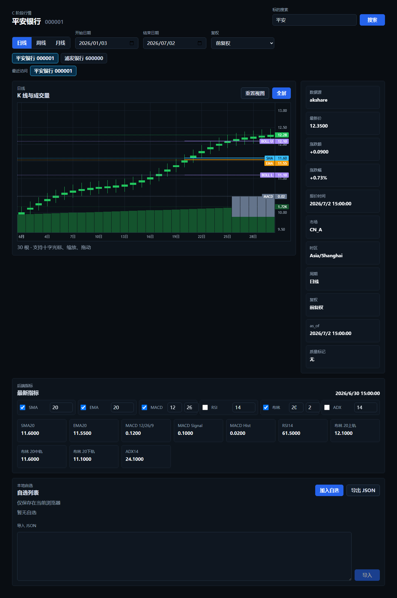

# QuantTrade 行情页专业化验收清单

日期：2026-07-02

分支：`feature/C-market-page-professional`

## 子任务验收

| 子任务 | 自动检查 | 自审结果 | 状态 |
|---|---|---|---|
| 行情数据正确性与状态 | `pytest backend/tests/test_akshare_market_data.py backend/tests/test_market_domain_contract.py` 通过 | 后端接口已支持日/周/月；周/月由日线按交易所时区聚合；延迟、来源、质量标记继续由服务端输出 | DONE |
| 主图、周期、复权和指标 | `pytest backend/tests/test_akshare_market_data.py backend/tests/test_market_snapshots_and_indicators.py`、`npm run build`、`npm run e2e -- --reporter=line tests/e2e/market.spec.ts` 通过 | 主图已切换 Lightweight Charts；周期和复权进入接口请求；指标参数由后端计算并在页面管理；图表支持十字光标、缩放、拖动、重置和全屏 | DONE |
| 搜索、自选、详情和用户偏好 | `pytest backend/tests/test_akshare_market_data.py`、`npm run build`、`npm run e2e -- --reporter=line tests/e2e/market.spec.ts` 通过 | 新增报价详情接口；搜索支持输入防抖和最近访问；自选保留旧 JSON 兼容并记录加入时间；周期、复权、指标参数和显隐偏好可安全保存与恢复 | DONE |
| 视觉收口、性能和 E2E | `make check`、`make test`、`make e2e` 通过 | 行情页已收口为深色专业看盘界面；查询增加合理新鲜时间；桌面截图已保存；整体 E2E 覆盖行情页和 Mock 回测 | DONE |

## P0 验收项

| 验收项 | 结果 | 证据 |
|---|---|---|
| 专业桌面布局 | PASS | `docs/acceptance/market-page-desktop.png` |
| 标的搜索可用 | PASS | `frontend/tests/e2e/market.spec.ts` |
| 标的标题和基础报价完整 | PASS | `/market/quote`、E2E 最新价断言 |
| 自选列表完整 | PASS | `watchlistStore.test.ts`、E2E 自选持久化 |
| K 线和成交量由 Lightweight Charts 渲染 | PASS | `frontend/src/components/MarketChart.tsx` |
| 日线、周线、月线可切换 | PASS | E2E 周线请求断言 |
| 不复权、前复权、后复权可切换 | PASS | E2E 后复权请求断言 |
| SMA、EMA、MACD、RSI、布林带、ADX 可配置 | PASS | 指标参数接口、E2E MACD 参数断言 |
| 图表十字光标、缩放、拖动、重置 | PASS | Lightweight Charts 配置、E2E 页面加载 |
| 数据更新时间和来源清楚 | PASS | 详情栏显示 provider、as_of、timezone |
| 延迟数据与质量警告明确 | PASS | E2E 降级和 STALE_CACHE 断言 |
| 加载、空数据、错误和重试状态 | PASS | E2E 请求错误断言、空图表状态 |
| 图表全屏 | PASS | 页面全屏切换按钮 |
| 用户偏好保存并安全恢复 | PASS | E2E 刷新后恢复周线/后复权 |
| 深色专业视觉风格 | PASS | `docs/acceptance/market-page-desktop.png` |
| 单元测试通过 | PASS | `npm test`，3 passed |
| E2E 通过 | PASS | `make e2e`，6 passed |
| `make check` 通过 | PASS | 2026-07-02 本地运行通过 |
| `make test` 通过 | PASS | 2026-07-02 本地运行通过 |
| `make e2e` 通过 | PASS | 2026-07-02 本地运行通过 |

## 最终截图

## 未完成 P1

未纳入本次 P0：多分组自选、拖拽排序、盘口五档、逐笔成交、新闻公告、交易联动。这些保持为后续 P1/P2，不影响 C 阶段行情展示验收。

## 风险和回滚

主要风险是 Lightweight Charts 主版本 API 变化、AKShare 字段变化、浏览器 LocalStorage 被用户写入非法内容。回滚方式：恢复本分支最近 4 个提交；数据口径仍可退回 C-BR2 的日线接口与旧 SVG 展示。旧缓存仍只允许行情展示，不进入正式回测、风控或交易。
